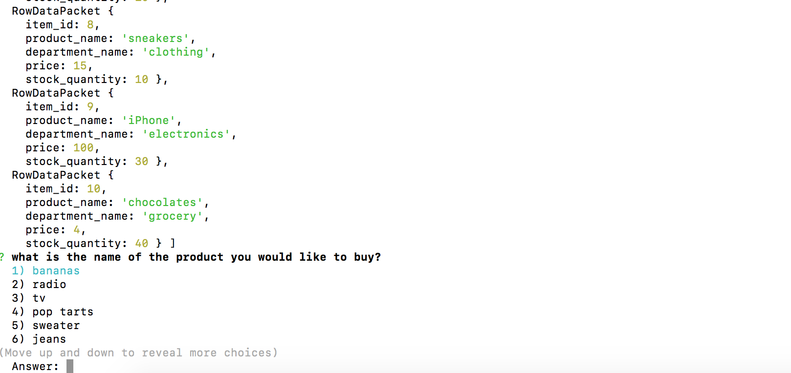
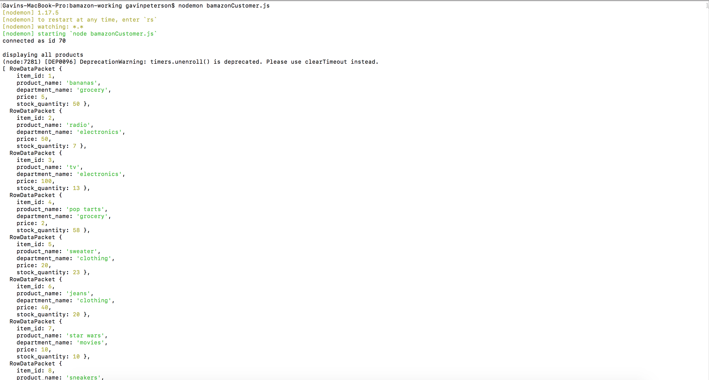
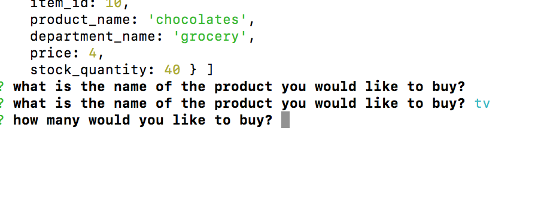
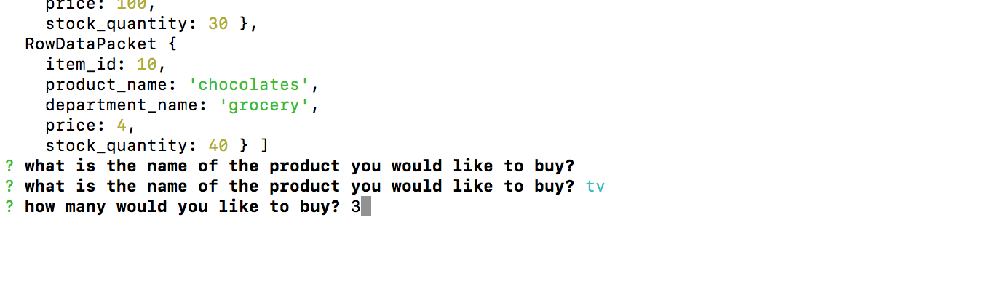
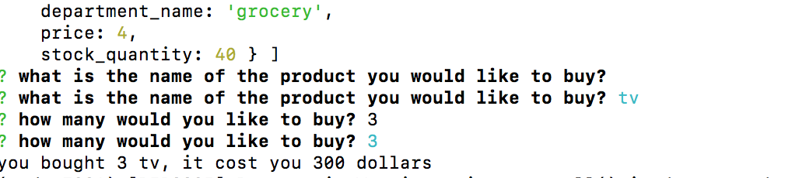

run nodemon bamazonCustomer.js

program will display all products in mysql then ask which you would like to purchase

input the number related to the product you would like to purchase and you will be asked how many you would like

if there are enough of said product available it will inform you of the item you purchased, how many you purchased, and the total cost of the purchase

